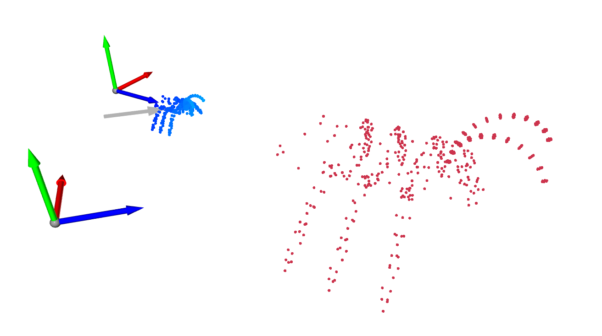

# Visual Odometry
This is a collection of visual odometry alogorithms.

## Essential Matrix

<p align="center"></p>

Estimate the Essential matrix from given 2D-2D pixel correspondences using the *eight-point algorithm* [1, 2]. 
The correspondences are generated synthetically by projecting a 3D point cloud into two camera images.
The relative pose between the cameras is recovered by factorizing the essential matrix which yields four potential solutions (teo rotation matrices and two translation vectors).
The correct solution for the pose is selected using the positive depth constraint: all observed points must lie in front of both cameras.

### Installation
1. Install Open3D: http://open3d.org/docs/compilation.html  
2. Clone the repository: ```git clone https://github.com/francisengelmann/visual_odometry.git```
3. Compile: ```mkdir build && cd build && cmake .. && make -j```

### References
[1] Hartley and Zisserman *"Multiple View Geometry in Computer Vision"*, Cambridge University Press, 2004.  
[2] Ma, Soatto, Kosecka, Sastry *"An Invitation to 3-D Vision: From Images to Geometric Models*, Springer, 2004.
